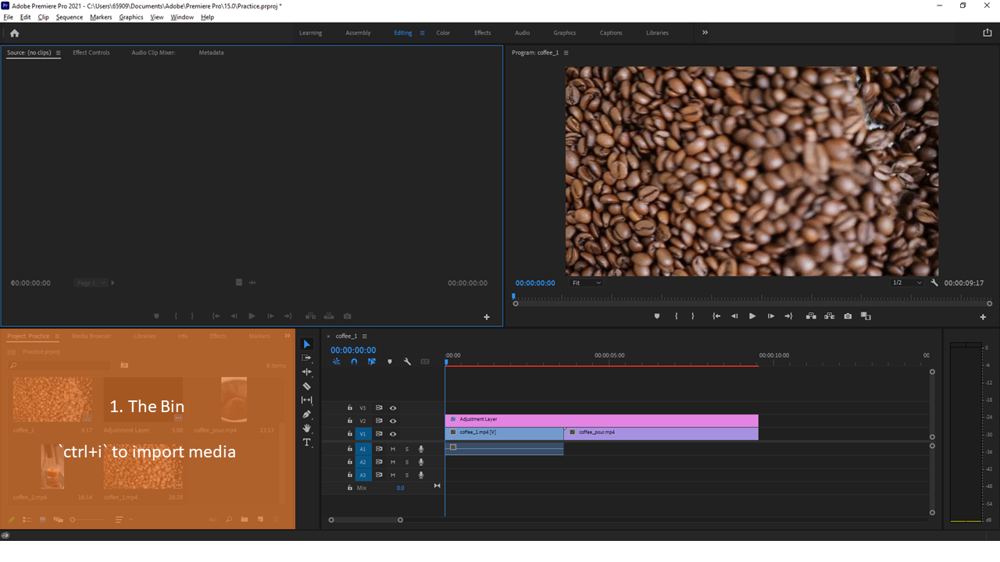
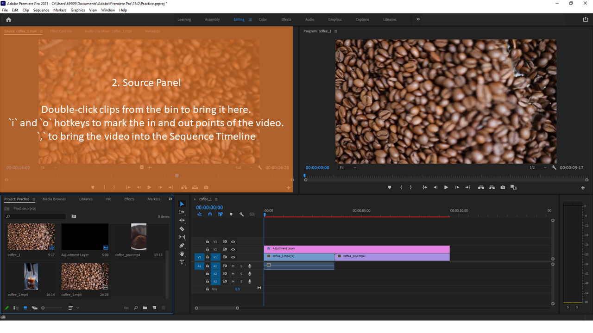
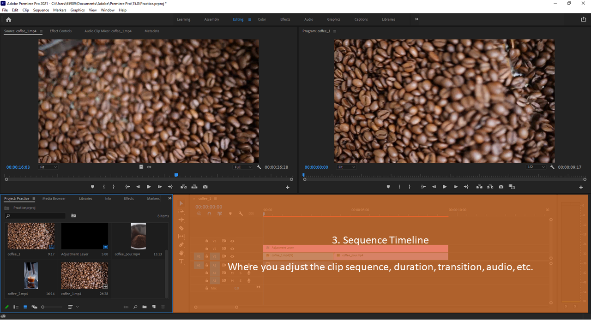
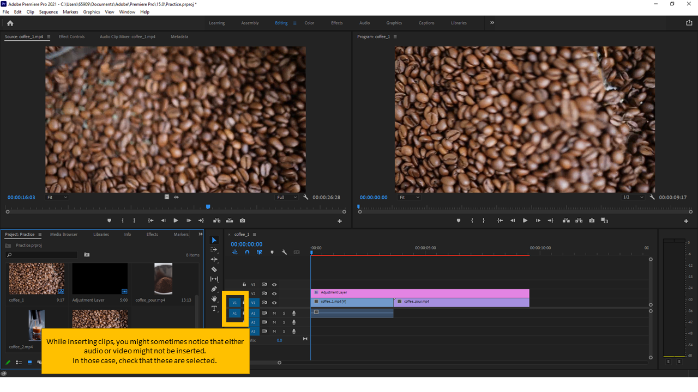
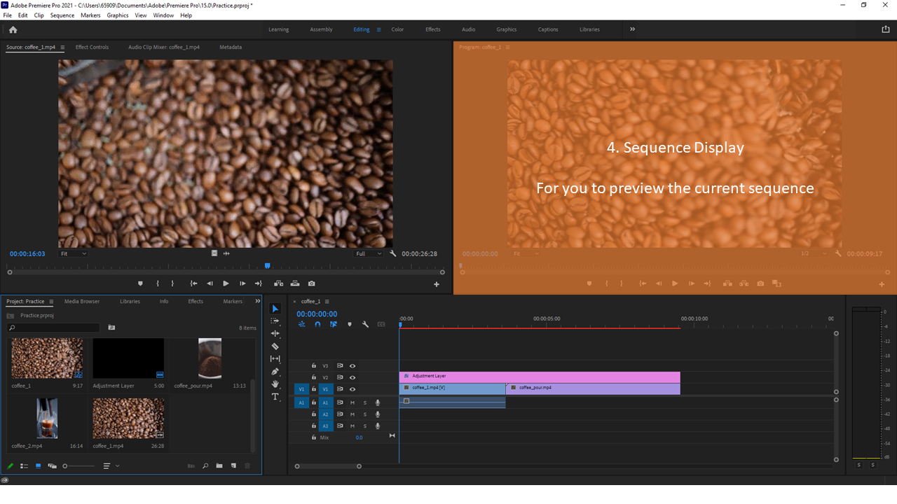

I wrote down the steps from the class by Jordy Vandeput on Skillshare. 
For me, video edit is a pain, mainly because of the sheer number of actions in the UI.

After going through the first video, I realized there is a logical design decision behind Adobe Premiere Pro.
That logical flow becomes obvious, once you understand the general workflow.

# General Workflow
All video edits start with the `bin`. The `bin` contains all the relevant resources. The video clips, the audio clips, the images, the different layers, etc. 

Double clicking on the video clips will bring it into the source panel for initial processing. 

One of the steps commonly taken here is choosing the in (`i`)  and out (`o`) points. And inserting (`,`) the selected portion to the sequence timeline. 

Sometimes, you might notice that only the audio is being imported, or maybe only the video. In those case, check that you have enabled the respective "source patching".

Lastly, you can preview the entire sequence through the Display Panel.

# Detailed Workflow
1. Import clips
2. Creating new Sequences, presets: DNxHR/DNxHD (works for 95% of the cases)
	1. Properly name your sequences
3. Change into Icon View in the bottom Right
4. Double Click to open b-rolls in Source Monitor
5. Find the parts you need
	1. I: in point
	2. O: outpoint
	3. ,: insert into Sequence Timeline
6. Alt + Scroll: increase reel height
7. M: insert marker in sequence, to help you organize the different b-rolls used in the sequence timeline
		1. usually used when you are in edit locked
8. Color labels are better marker gives you a color indication of the clips
9. N: move out put and in point of two adjacent clips
	1. markers ended up in the wrong point
10. New Adjustment Layer
	1. place on top of clips
	2. apply effect on adjustment layer, and it will be applied to all clips below it
	3. Crop Effect
	4. Black and White Effect (under video effects > image control)
11. Refer to Effect Controls on the top left panel
	1. allows you to make finer adjustments to the effects
12. You can adjust both adjustment layer and the clip
13. Add Keyframes for animation in the effect control
